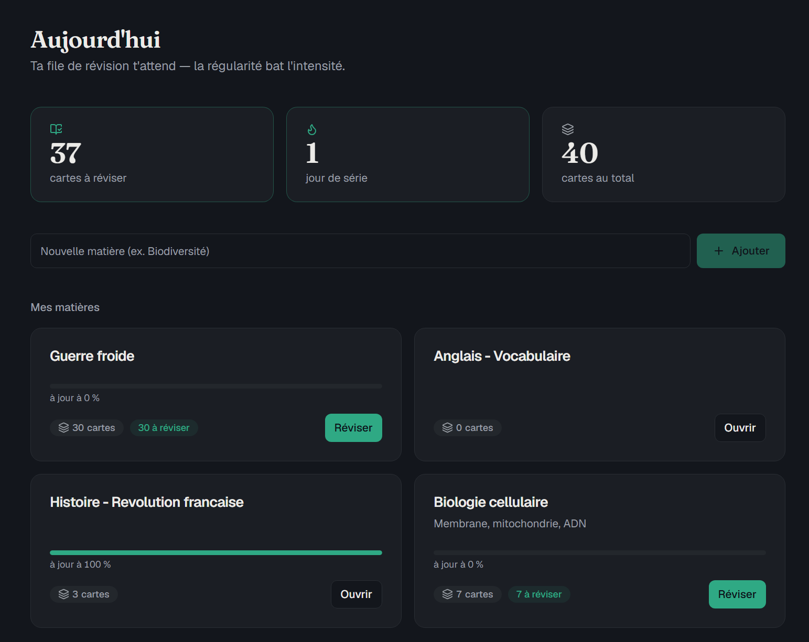
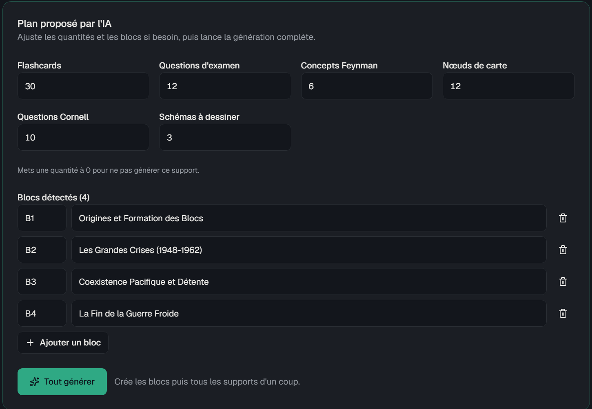
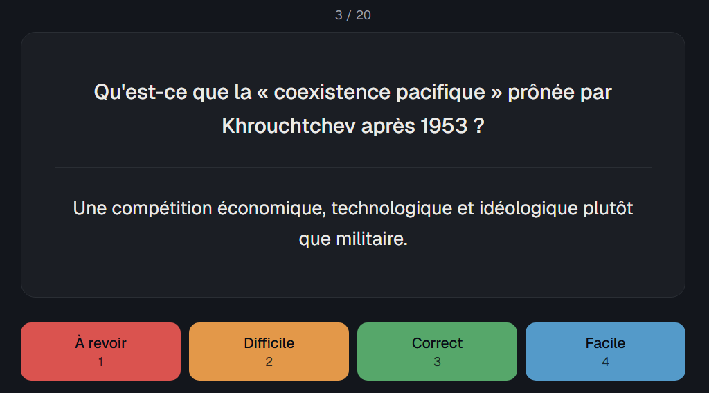
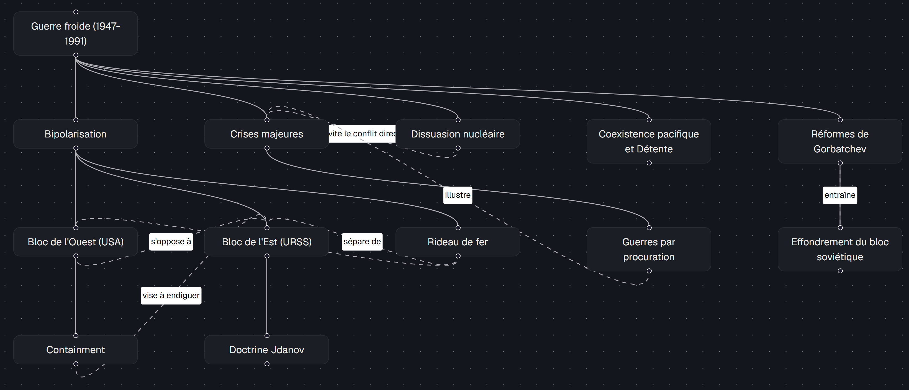
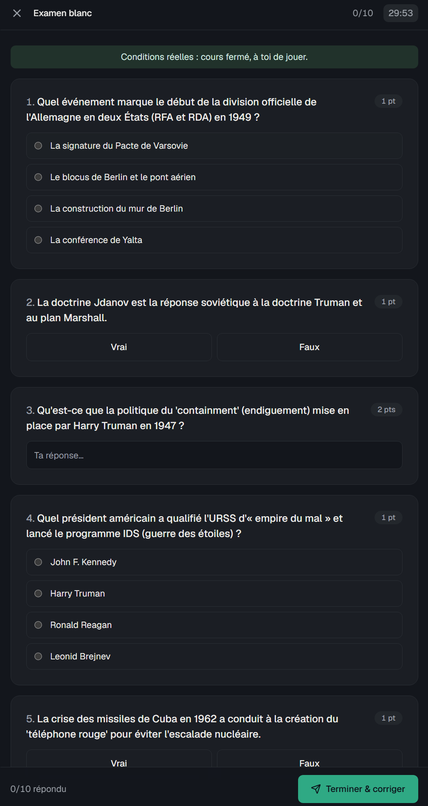
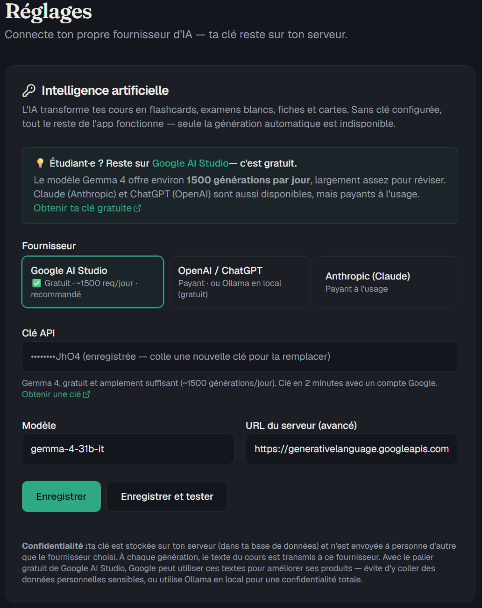

# revision-app

Environnement de révision **sain** (anti-bachotage), bâti sur les méthodes validées
scientifiquement : active recall, répétition espacée (**FSRS-5**), interleaving,
technique Feynman, fiches Cornell, dual coding, anti-fluence et garde-fous
sommeil/charge.

Colle ton cours (n'importe quelle matière) : l'IA en génère un plan de révision
complet — flashcards, examen blanc chronométré, concepts à expliquer à voix haute,
carte conceptuelle, fiche Cornell et schémas à dessiner. Tu valides, tu révises.

> 🇫🇷 L'interface est en français. Le contenu généré (cartes, questions…) suit la
> langue de ton cours.

## 📸 Aperçu

*Exemple réel : un cours « Guerre froide » transformé en supports de révision
complets par l'IA, à partir d'un simple texte collé.*



**« Tout générer » — l'IA lit ton cours, découpe en blocs et propose un plan
complet que tu ajustes avant de lancer :**



<table>
  <tr>
    <td width="50%" align="center">
      <br>
      <sub><b>Révision</b> — répétition espacée (FSRS), tu notes ta réponse</sub>
    </td>
    <td width="50%" align="center">
      <br>
      <sub><b>Carte conceptuelle</b> — hiérarchie et liens transversaux</sub>
    </td>
  </tr>
  <tr>
    <td width="50%" align="center">
      <br>
      <sub><b>Examen blanc</b> — types mélangés, chronométré, correction IA</sub>
    </td>
    <td width="50%" align="center">
      <br>
      <sub><b>Réglages</b> — colle ta clé gratuite, et c'est parti</sub>
    </td>
  </tr>
</table>

## ✨ Fonctionnalités

- **Flashcards FSRS-5** — répétition espacée moderne (scheduler implémenté en Rust pur),
  files de révision par matière, interleaving entre blocs.
- **« Tout générer »** — l'IA lit ton cours, propose un plan (blocs + quantités) que tu
  peux ajuster, puis génère tous les supports d'un coup.
- **Examens blancs** — QCM, vrai/faux, réponses courtes et questions ouvertes,
  chronométrés ; les réponses libres sont corrigées par l'IA avec feedback.
- **Feynman** — une liste de mécanismes à savoir expliquer « comme à un enfant »,
  avec auto-évaluation.
- **Fiches Cornell** — notes structurées + questions de rappel en marge,
  convertibles en flashcards.
- **Cartes conceptuelles** — hiérarchie + liens transversaux, rendu interactif.
- **Schémas (dual coding)** — l'IA te dit *quoi* dessiner et ce que le schéma doit
  contenir ; **c'est toi qui dessines, de mémoire**, puis tu compares. C'est voulu :
  un schéma déjà dessiné ne ferait rien apprendre.
- **Garde-fous santé** — nudge sommeil après 22 h, jour de repos, plafonds de charge,
  suivi de série (streak). C'est un outil d'apprentissage durable, pas de cramming.

## 🤖 L'IA : ta clé, gratuite (BYOK)

Pour que l'IA travaille pour toi, il faut une « clé API » — un long mot de passe
fourni par un service d'IA. Tu la colles **une seule fois** dans la page
**Réglages** de l'app ; aucun fichier à éditer.

### 👉 Recommandé : Google AI Studio, **gratuit**

Pour des étudiant·e·s, pas besoin de payer. **Google AI Studio** donne accès au
modèle **Gemma 4** gratuitement, avec environ **1500 générations par jour** — bien
plus que nécessaire pour réviser. Pas de carte bancaire.

➡️ **[Guide pas à pas pour obtenir ta clé gratuite (2 min)](docs/obtenir-une-cle-gemini.md)**

### Autres fournisseurs (optionnels)

| Fournisseur | Coût | Pour qui |
|---|---|---|
| 🟢 **Google AI Studio** (Gemma 4) | **Gratuit** · ~1500 req/jour | **Recommandé** — la plupart des utilisateurs |
| **Anthropic** (Claude) | 💳 Payant à l'usage | Si tu as déjà un compte Claude |
| **OpenAI** (ChatGPT) | 💳 Payant à l'usage | Si tu as déjà un compte OpenAI |
| **Ollama / LM Studio** | Gratuit, **100 % local** | Confidentialité totale (rien ne quitte ta machine) — via le fournisseur « OpenAI-compatible » |

> Sans clé configurée, tout le reste de l'app fonctionne quand même (création
> manuelle de cartes, fiches, examens, révision avec répétition espacée) — seule
> la **génération automatique** depuis un cours est en pause, et l'app te le dit
> clairement avec un bouton « Configurer ».

## 🚀 Installation (5 minutes)

**Prérequis : [Docker Desktop](https://www.docker.com/products/docker-desktop/)**
(Windows/Mac) ou Docker Engine + le plugin compose (Linux). C'est tout.

1. **Récupère le code** — soit avec git, soit en
   [téléchargeant le ZIP](https://github.com/TristanPLS/revision-app/archive/refs/heads/main.zip) :

   ```bash
   git clone https://github.com/TristanPLS/revision-app.git
   cd revision-app
   ```

2. **Lance l'application** (aucun fichier à éditer) :

   ```bash
   docker compose up -d
   ```

   La première fois, Docker récupère les images pré-construites (2 à 5 min). Si
   elles ne sont pas encore disponibles, il construit l'application localement à
   la place — c'est plus long (la compilation Rust peut prendre 10-20 min) mais
   ça fonctionne sans rien faire de plus.

3. **Ouvre http://localhost:3000**, va dans **Réglages**, colle ta clé API
   gratuite (voir le [guide pas à pas](docs/obtenir-une-cle-gemini.md)), clique
   « Enregistrer et tester ». ✅

Comment savoir que ça marche : la page d'accueil s'affiche, et le test de
connexion dans Réglages répond « Connexion réussie ».

### 🎬 Essayer avec un cours d'exemple (sans clé IA)

Tu veux voir l'app **déjà remplie** avant de configurer ta clé ? Charge le cours
de démonstration « Guerre froide » (généré par l'IA : 34 flashcards, examen
blanc, fiche Cornell, carte conceptuelle, schémas) :

```bash
docker compose exec -T postgres psql -U revision revision < scripts/demo-seed.sql
```

Recharge http://localhost:3000 : la matière **« Guerre froide (démo) »** t'attend,
prête à réviser, **sans aucune clé IA**. Pour la retirer, supprime simplement la
matière depuis l'app.

**Mise à jour** : `docker compose pull && docker compose up -d` (ou
`docker compose up -d --build` si tu construis localement). Tes données sont
conservées (volume Docker `pgdata`).

### Accéder depuis ton téléphone / un autre appareil

- **Réseau local (Wi-Fi de la maison)** : crée un fichier `.env` contenant
  `BIND_ADDR=0.0.0.0`, relance `docker compose up -d`, puis ouvre
  `http://IP-DE-TON-PC:3000`. ⚠️ Lis d'abord l'encadré Sécurité.
- **Depuis n'importe où (recommandé)** : installe [Tailscale](https://tailscale.com)
  (VPN privé gratuit) sur le serveur et tes appareils, puis :
  `tailscale serve --bg --https=443 http://127.0.0.1:3000`
  → `https://ton-serveur.ton-tailnet.ts.net`, chiffré et accessible uniquement
  par tes appareils.

## 🔒 Sécurité — à lire avant d'exposer quoi que ce soit

> **Cette application est mono-utilisateur et n'a AUCUNE authentification.**
> Quiconque peut ouvrir la page peut lire, modifier et supprimer toutes tes
> données, et consommer ton quota/ta clé IA.
>
> - ✅ OK : `localhost` (défaut), réseau domestique de confiance, Tailscale/VPN.
> - ❌ JAMAIS : exposition directe sur internet (port-forwarding, VPS avec port
>   ouvert, reverse-proxy public sans authentification).
>
> Par défaut, seul le frontend est publié et uniquement en local (`127.0.0.1`) ;
> la base de données et le backend ne sont pas joignables depuis l'extérieur.
> La clé API est stockée **en clair** dans la base de données locale.

## 🔐 Confidentialité

- **Tout reste chez toi** (base de données locale), **sauf** les appels IA : à
  chaque génération, le texte du cours est envoyé au fournisseur que tu as choisi.
- **Palier gratuit Google AI Studio** : Google peut utiliser les textes envoyés
  pour améliorer ses produits (relecture humaine possible). Évite d'y coller des
  données personnelles sensibles ; le palier payant n'a pas cette clause.
- **Confidentialité totale** : utilise **Ollama** en local (fournisseur
  « OpenAI-compatible », URL `http://host.docker.internal:11434/v1`, clé vide) —
  rien ne quitte ta machine.

## 💾 Sauvegarde

Tes données (cartes, historique FSRS, examens…) vivent dans le volume Docker
`pgdata`. Pour les sauvegarder / restaurer :

```bash
# Sauvegarde → fichier revision-backup.sql
docker compose exec postgres pg_dump -U revision revision > revision-backup.sql

# Restauration (base vide)
docker compose exec -T postgres psql -U revision revision < revision-backup.sql
```

⚠️ `docker compose down -v` **détruit le volume et tout ton historique** —
n'utilise jamais `-v` sans sauvegarde.

## ⚙️ Configuration avancée (optionnelle)

Tout a une valeur par défaut ; un fichier `.env` (copié depuis
[`.env.example`](.env.example)) permet d'ajuster :

| Variable | Défaut | Rôle |
|---|---|---|
| `FRONTEND_PORT` | `3000` | Port de l'interface |
| `BIND_ADDR` | `127.0.0.1` | `0.0.0.0` = accessible depuis le réseau local |
| `TZ` | `Europe/Paris` | Fuseau (streak, garde-fou sommeil 22 h–5 h) |
| `FSRS_RETENTION` | `0.9` | Rétention cible FSRS (0.7–0.97) |
| `AI_MAX_SOURCE_CHARS` | `16000` | Taille max du cours injecté dans les prompts |
| `GEMINI_API_KEY`, `AI_PROVIDER`, `AI_MODEL`, `GEMINI_BASE_URL` | — | Valeurs initiales IA ; la page Réglages a priorité |
| `POSTGRES_PASSWORD` | `revision-local-only` | La BDD n'est pas exposée hors du réseau Docker |

## 🛠️ Développement

Stack : **Rust** (Axum + sqlx, scheduler FSRS-5 maison) · **Next.js** (App Router,
TypeScript, Tailwind v4, shadcn/ui) · **PostgreSQL**.

```bash
cp .env.example .env        # décommenter DATABASE_URL (localhost:5433)

# 1) Postgres seul (publié sur localhost:5433)
docker compose -f docker-compose.dev.yml up -d

# 2) Backend (migrations auto au démarrage)
cd backend && cargo run     # http://localhost:8080  (GET /api/health)

# 3) Frontend
cd frontend && pnpm install && pnpm dev   # http://localhost:3000
```

Le frontend appelle l'API en même origine (`/api/*`) via les rewrites Next.js →
aucun CORS. Avant de proposer une PR, fais tourner exactement ce que vérifie la CI
(voir [CONTRIBUTING.md](CONTRIBUTING.md)) :

```bash
cd backend  && cargo fmt --check && cargo clippy -- -D warnings && cargo test
cd frontend && pnpm lint && pnpm exec tsc --noEmit && pnpm build
```

### Structure

- `backend/` — API Axum, `migrations/`, `src/{ai,srs,models,routes}`
  - `src/ai/client.rs` — client multi-provider (Gemini / OpenAI-compat / Anthropic)
  - `src/srs.rs` — FSRS-5 pur Rust (testé)
- `frontend/` — app Next.js (`src/app`, `src/components`, `src/lib/api`)
- `docker-compose.yml` (prod, images GHCR) · `docker-compose.dev.yml` (Postgres seul)

## 🧭 Philosophie (et ce que l'app ne fera pas)

- Pas de mode « bachotage » : l'app t'arrête après tes plafonds de charge et te
  pousse à dormir après 22 h. Le dimanche est un jour de repos.
- L'IA **ne dessine pas les schémas à ta place** et ne te fait pas relire
  passivement : tout est conçu pour te faire **produire** (recall, explication,
  dessin) — c'est là que la mémoire se construit.
- Mono-utilisateur par design : 1 instance = 1 personne. Le multi-utilisateurs
  n'est pas un objectif de la v1.

## 🚢 Publication (checklist mainteneur)

Avant de rendre le dépôt public, pour que `docker compose up` fonctionne vraiment
chez les utilisateurs :

- [ ] **Nom du dépôt = `revision-app`** (les liens ci-dessus et les images GHCR le
  supposent). Renomme-le dans *Settings → Repository name* si besoin.
- [ ] **Publier les images** : pousse sur `main` ou crée un tag `v*` → le workflow
  `docker.yml` construit et publie sur GHCR.
- [ ] **Rendre les paquets GHCR publics** : *Profil → Packages →
  `revision-app-backend` / `revision-app-frontend` → Package settings → Change
  visibility → Public*. Sans ça, `docker compose pull` échoue pour les visiteurs
  (il retombe alors sur un build local, plus lent).
- [ ] **Faire tourner ta clé Gemini de dev** par précaution (elle n'est pas dans
  le dépôt, mais a pu transiter dans des outils).

## 📄 Licence

[MIT](LICENSE) — fais-en bon usage. Les contributions sont bienvenues
(issues et PRs).
